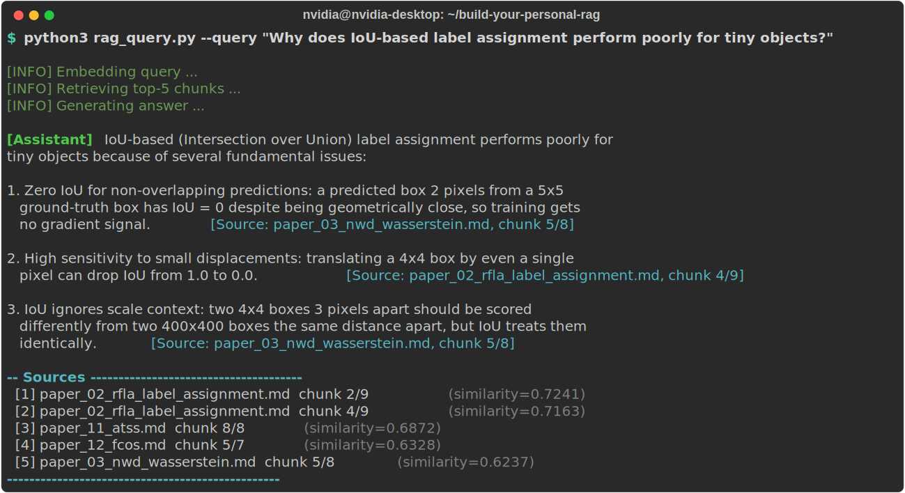
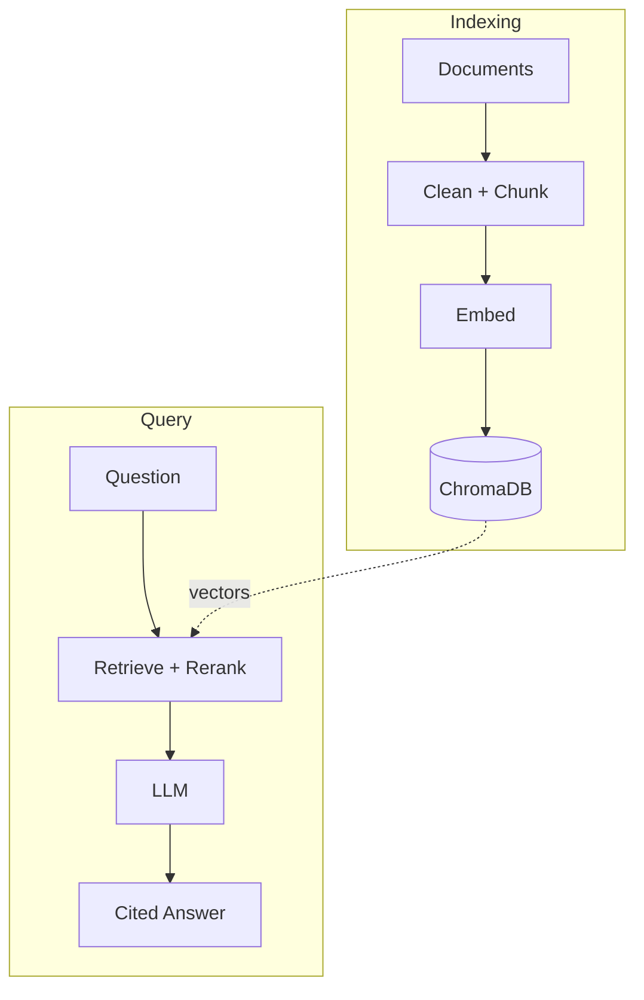

# UAV Small Object Detection RAG

> A local-first, citation-backed RAG template. Ships with a 22-paper UAV small-object-detection example; drop your own files into `data/raw/` to make it yours.

[](https://github.com/poweichen00/personal-rag/actions/workflows/ci.yml)


**English** | [繁體中文](README.zh-TW.md)

<p align="center">
  
  <br>
  <em>A natural-language question answered entirely offline on a Jetson Orin, with every claim cited to its source paper.</em>
</p>

---

## Overview

UAV small object detection is a notoriously hard sub-field of computer vision: objects are often a handful of pixels, densely packed, and seen from unusual angles. This project distills **22 key papers**, from foundational detectors to the latest drone-specific methods, into a queryable knowledge base.

Ask a natural-language question and the system retrieves the most relevant passages, reranks them, and asks an LLM to answer **only from the retrieved evidence**, citing each source inline. It runs entirely on local, free models (Ollama + ChromaDB) with an OpenAI-compatible endpoint for generation.

## Features

- **Citation-backed answers:** every response cites the source paper and chunk, so claims are verifiable.
- **Local-first & free:** Ollama embeddings + ChromaDB + optional local Ollama generation; **no OpenAI account, no Docker, no cloud cost**.
- **Idempotent, incremental indexing:** MD5 hash cache + deterministic upserts make re-runs safe and fast.
- **Hybrid retrieval:** dense cosine similarity combined with lexical-overlap reranking for sharper results.
- **Auto-generated skill spec:** produces a structured `skill.md`, with a deterministic fallback when no LLM is available.
- **Interactive or single-shot:** multi-turn REPL or one-off `--query` mode.

---

## Project Structure

```
.
├── data/
│   ├── raw/               # 22 source papers in Markdown format
│   └── processed/         # Cleaned plain-text (auto-generated, git-ignored)
├── chroma_db/             # ChromaDB persistent vector store (git-ignored)
├── data_update.py         # Pipeline: raw → clean → chunk → embed → ChromaDB
├── rag_query.py           # Query interface: embed → retrieve → rerank → LLM → answer
├── skill_builder.py       # Generates skill.md from the RAG knowledge base
├── skill.md               # Structured agent skill description (auto-generated, git-ignored)
├── tests/                 # Unit tests for chunking & retrieval (pytest)
├── requirements.txt       # Python dependencies
├── requirements-dev.txt   # Dev/test dependencies (pytest)
├── .env.example           # Environment variable template (no real keys)
└── .gitignore
```

---

## Architecture



---

## Tech Stack

| Component | Technology | Why |
|-----------|-----------|-----|
| Embedding | Ollama `nomic-embed-text` | Free, local, 768-dim |
| Vector DB | ChromaDB (PersistentClient) | Pure Python, no Docker |
| LLM | Any OpenAI-compatible endpoint, local (Ollama, LM Studio) or hosted | Pluggable; swap models via `.env` |
| PDF parsing | pypdf | Lightweight, pure Python |
| Env management | python-dotenv | Keeps keys out of code |

---

## Knowledge Domain

> *Describes the **bundled UAV example**. After you swap in your own data (see "Use it for Your Own Data" below), this section reflects whatever you've indexed.*

**Topic:** UAV Small Object Detection (無人機小物體偵測)

22 papers covering:
- **Datasets**: VisDrone, DOTA
- **Label Assignment**: ATSS, RFLA, NWD
- **Anchor-free Detectors**: FCOS, CenterNet, TOOD
- **Transformer-based**: Deformable DETR, DINO, QueryDet
- **Attention & Backbone**: CBAM, FPN, LSKNet, PKINet
- **Inference Tricks**: SAHI (slicing-aided hyper-inference)
- **Lightweight Models**: SlimNet, GSConv, YOLOv9, LAM-YOLO
- **Super-Resolution**: B2BDet

---

## Source Papers & Licenses

All 22 papers are openly licensed academic works retrieved from arXiv, and every file in `data/raw/` records its title, arXiv ID, authors, venue, and license in its header.

**License compliance:** 20 papers are under **CC BY 4.0** (attribution only), one (SAHI) ships its reference implementation under **Apache 2.0**, and two carry non-commercial / no-derivatives clauses: **FCOS (CC BY-NC-SA 4.0)** and **QueryDet (CC BY-NC-ND 4.0)**. The corpus is used for **non-commercial research and study with full attribution**, which stays within the terms of every license above. Original authors retain all rights; see each file header and the linked arXiv page for the authoritative license.

<details>
<summary><b>Full paper list (22), click to expand</b></summary>

| # | Title (short) | Venue / Year | arXiv | License |
|--:|---------------|--------------|-------|---------|
| 01 | Vision Meets Drones (VisDrone) | arXiv 2018 | [1804.07437](https://arxiv.org/abs/1804.07437) | CC BY 4.0 |
| 02 | RFLA: Gaussian Receptive Field Label Assignment | ECCV 2022 | [2208.08738](https://arxiv.org/abs/2208.08738) | CC BY 4.0 |
| 03 | Normalized Gaussian Wasserstein Distance (NWD) | ISPRS J. 2022 | [2110.13389](https://arxiv.org/abs/2110.13389) | CC BY 4.0 |
| 04 | Slicing Aided Hyper Inference (SAHI) | ICIP 2022 | [2202.06934](https://arxiv.org/abs/2202.06934) | Apache 2.0 |
| 05 | TPH-YOLOv5 (Transformer Prediction Head) | ICCV-W 2021 | [2108.11539](https://arxiv.org/abs/2108.11539) | CC BY 4.0 |
| 06 | DOTA: Large-Scale Aerial Detection Dataset | CVPR 2018 | [1711.10398](https://arxiv.org/abs/1711.10398) | CC BY 4.0 |
| 07 | PKINet: Poly Kernel Inception Network | CVPR 2024 | [2403.06258](https://arxiv.org/abs/2403.06258) | CC BY 4.0 |
| 08 | Slim-Neck by GSConv | arXiv 2022 | [2206.02424](https://arxiv.org/abs/2206.02424) | CC BY 4.0 |
| 09 | Deformable DETR | ICLR 2021 | [2010.04159](https://arxiv.org/abs/2010.04159) | CC BY 4.0 |
| 10 | LSKNet: Large Selective Kernel Network | ICCV 2023 | [2303.09030](https://arxiv.org/abs/2303.09030) | CC BY 4.0 |
| 11 | ATSS: Adaptive Training Sample Selection | CVPR 2020 | [1912.02424](https://arxiv.org/abs/1912.02424) | CC BY 4.0 |
| 12 | FCOS: Fully Convolutional One-Stage | ICCV 2019 | [1904.01355](https://arxiv.org/abs/1904.01355) | CC BY-NC-SA 4.0 |
| 13 | TOOD: Task-Aligned One-Stage Detection | ICCV 2021 | [2108.07755](https://arxiv.org/abs/2108.07755) | CC BY 4.0 |
| 14 | QueryDet: Cascaded Sparse Query | CVPR 2022 | [2103.09136](https://arxiv.org/abs/2103.09136) | CC BY-NC-ND 4.0 |
| 15 | DINO: DETR with Improved DeNoising | arXiv 2022 | [2203.03605](https://arxiv.org/abs/2203.03605) | CC BY 4.0 |
| 16 | CBAM: Convolutional Block Attention Module | ECCV 2018 | [1807.06521](https://arxiv.org/abs/1807.06521) | CC BY 4.0 |
| 17 | FPN: Feature Pyramid Networks | CVPR 2017 | [1612.03144](https://arxiv.org/abs/1612.03144) | CC BY 4.0 |
| 18 | CenterNet: Objects as Points | arXiv 2019 | [1904.07850](https://arxiv.org/abs/1904.07850) | CC BY 4.0 |
| 19 | YOLOv9: Programmable Gradient Information | arXiv 2024 | [2402.13616](https://arxiv.org/abs/2402.13616) | CC BY 4.0 |
| 20 | LAM-YOLO: Lighting-Occlusion Attention YOLO | arXiv 2024 | [2411.00485](https://arxiv.org/abs/2411.00485) | CC BY 4.0 |
| 21 | Scale Optimization via Evolutionary RL | AAAI 2024 | [2312.15219](https://arxiv.org/abs/2312.15219) | CC BY 4.0 |
| 22 | B2BDet: Aerial Detection with Super-Resolution | arXiv 2024 | [2401.14661](https://arxiv.org/abs/2401.14661) | CC BY 4.0 |

</details>

---

## Installation

### 1. Install dependencies
```bash
pip install -r requirements.txt
```

### 2. Install and start Ollama
```bash
# Install: https://ollama.ai
ollama pull nomic-embed-text
ollama serve   # runs on http://localhost:11434
```

### 3. Configure your LLM endpoint

Copy `.env.example` to `.env`, then pick **one** of the options below. The rest of the pipeline is identical.

**Option A: Fully local with Ollama (recommended, free, offline).** Ollama already runs the embeddings; it also speaks the OpenAI-compatible chat API, so it can do generation too. **No OpenAI account needed.**

```bash
ollama pull llama3.1     # or qwen2.5:7b, gemma2, etc.
```

In `.env`:
```bash
LITELLM_BASE_URL=http://localhost:11434/v1
LITELLM_API_KEY=ollama        # any non-empty string; Ollama ignores it
DEFAULT_LLM_MODEL=llama3.1     # native Ollama tag (no "openai/" prefix)
```

LM Studio (`:1234/v1`), llama.cpp `llama-server` (`:8080/v1`), and vLLM (`:8000/v1`) work the same way; just change `LITELLM_BASE_URL`.

**Option B: Hosted OpenAI-compatible endpoint.** If you have access to one (OpenAI, LiteLLM proxy, Together, etc.):

```bash
LITELLM_API_KEY=your_api_key_here
LITELLM_BASE_URL=https://your-llm-endpoint.example.com/v1
DEFAULT_LLM_MODEL=openai/your-model-name
```

Switch between Option A and B anytime by editing `.env`, with no code changes.

---

## Usage

### Build the vector index
```bash
# First time or full rebuild:
python3 data_update.py --rebuild

# Incremental update (only changed files):
python3 data_update.py
```

### Query the knowledge base
```bash
# Single query:
python3 rag_query.py --query "What is SAHI and how does it improve small object detection?"

# Interactive multi-turn mode:
python3 rag_query.py

# Options:
python3 rag_query.py --help
```

### Generate the skill specification
```bash
python3 skill_builder.py
# Outputs: skill.md
```

---

## Example

The query from the demo above, as copy-pastable text (bundled 22-paper corpus, generated fully offline with `qwen2.5:7b` + `nomic-embed-text`):

<details>
<summary>Show the run as text</summary>

```console
$ python3 rag_query.py --query "Why does IoU-based label assignment perform poorly for tiny objects?"

[INFO] Embedding query ...
[INFO] Retrieving top-5 chunks ...
[INFO] Generating answer ...

[Assistant] IoU-based (Intersection over Union) label assignment performs poorly for
tiny objects because of several fundamental issues:

1. Zero IoU for non-overlapping predictions: a predicted box 2 pixels from a 5x5
   ground-truth box has IoU = 0 despite being geometrically close, so training gets
   no gradient signal.  [Source: paper_03_nwd_wasserstein.md, chunk 5/8]

2. High sensitivity to small displacements: translating a 4x4 box by even a single
   pixel can drop IoU from 1.0 to 0.0.  [Source: paper_02_rfla_label_assignment.md, chunk 4/9]

3. IoU ignores scale context: two 4x4 boxes 3 pixels apart should be scored
   differently from two 400x400 boxes the same distance apart, but IoU treats them
   identically.  [Source: paper_03_nwd_wasserstein.md, chunk 5/8]

── Sources ──────────────────────────────────────
  [1] paper_02_rfla_label_assignment.md  chunk 2/9  (similarity=0.7241)
  [2] paper_02_rfla_label_assignment.md  chunk 4/9  (similarity=0.7163)
  [3] paper_11_atss.md  chunk 8/8  (similarity=0.6872)
  [4] paper_12_fcos.md  chunk 5/7  (similarity=0.6328)
  [5] paper_03_nwd_wasserstein.md  chunk 5/8  (similarity=0.6237)
─────────────────────────────────────────────────
```

</details>

> Answer abridged for brevity. The model answers only from the retrieved passages and cites each one, so every claim stays verifiable.

---

## Tests

The text-processing and retrieval helpers are covered by unit tests. They
exercise the pure functions directly, so **no Ollama or ChromaDB is needed**:

```bash
pip install -r requirements-dev.txt
pytest -q
```

---

## Use it for Your Own Data

The bundled corpus is a UAV small-object-detection example, but the pipeline is generic. Once Installation and Usage above work for you on the bundled example, follow these four steps to swap in your own data, with **no code changes needed**.

### Step 1: Add your documents

Replace the bundled 22 papers in `data/raw/` with your own files. Markdown, plain text, and PDFs all work; abstracts and structured notes index better than 500-page PDFs.

```bash
git clone https://github.com/poweichen00/personal-rag.git
cd personal-rag

# Recommended: remove the bundled UAV example first for a clean swap
rm data/raw/paper_*.md

# Copy your own files in
cp ~/your-docs/*.md  data/raw/      # or *.pdf, *.txt
```

> Keeping the bundled papers *alongside* your own is technically supported, but mixing unrelated topics in one vector store usually hurts retrieval. A clean swap is recommended unless you explicitly want to mix.

### Step 2: Tell the system what your domain is

Edit `.env` (`cp .env.example .env` first if you haven't) and set two variables. A real example:

```bash
RAG_DOMAIN=quantum computing fundamentals
COLLECTION_NAME=quantum_computing
```

`RAG_DOMAIN` shapes the assistant's system prompt; `COLLECTION_NAME` keeps your new vector store separate from the bundled UAV one.

### Step 3: (Optional) Customise the seed questions

`skill_builder.py` probes the knowledge base with a few seed questions. To override the built-in (UAV) defaults, create a JSON file with this shape:

```json
{
  "concepts": ["What is X?", "How does Y work?"],
  "trends":   ["How has Z evolved over time?"],
  "entities": ["Which datasets / methods / people are central?"]
}
```

Then add to `.env`:

```bash
SEED_QUESTIONS_FILE=./seed_questions.json
```

### Step 4: Rebuild the index and query

```bash
python3 data_update.py --rebuild
python3 rag_query.py --query "your question here"
```

Retrieval, reranking, and the rest of the pipeline run unchanged on your data.

---

## Project Stats

| Metric | Value |
|---|---|
| Source papers | 22 (arXiv, 2016-2025) |
| Corpus | ~11,300 words of abstracts & structured notes |
| Vector chunks | 183 (avg 8.3 per paper, range 7-11) |
| Chunk length | avg 453 chars, median 483 (≤600, 100 overlap) |
| Embedding dimension | 768 (nomic-embed-text) |
| Topic categories | 8 (datasets, label assignment, anchor-free, transformer, attention, inference tricks, lightweight, super-resolution) |
| Similarity metric | Cosine + lexical-overlap reranking |
| Top-K retrieval | 5 per query (K×3 fetched, then reranked) |

---

## License & Attribution

- **Project code** is released under the [MIT License](LICENSE).
- **Source papers** retain their original licenses (see [Source Papers & Licenses](#-source-papers--licenses)) and are used here for non-commercial research with attribution.

---

## Acknowledgements

Built on the open research of the UAV / small-object-detection community: the authors of VisDrone, DOTA, NWD, RFLA, SAHI, and the other papers listed above. Powered by [Ollama](https://ollama.ai), [ChromaDB](https://www.trychroma.com/), and the [nomic-embed-text](https://www.nomic.ai/) embedding model.
