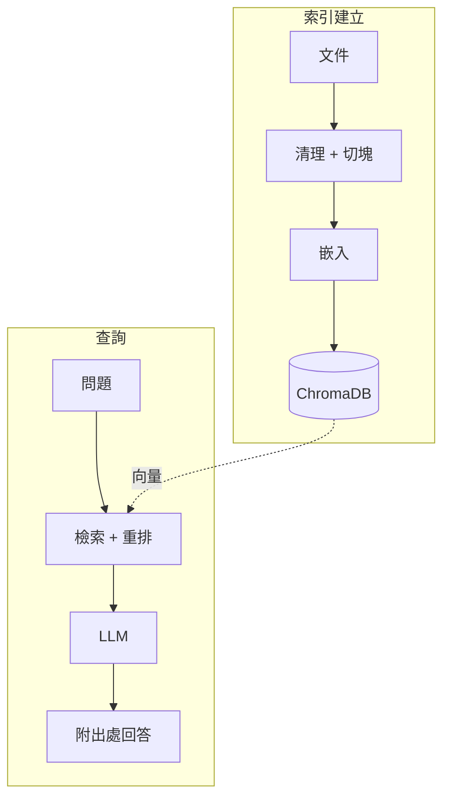

# 無人機小物體偵測 RAG

> 本地優先、附出處引用的個人 RAG 範本，內建 22 篇無人機小物體偵測論文當示範；把你自己的檔案丟進 `data/raw/`，它就變成你的 RAG。

[](https://github.com/poweichen00/personal-rag/actions/workflows/ci.yml)


[English](README.md) | **繁體中文**

<p align="center">
  
  <br>
  <em>在 Jetson Orin 上完全離線回答一個自然語言問題，每個論點都引用到來源論文。</em>
</p>

---

## 專案簡介

無人機小物體偵測是電腦視覺中出了名困難的子領域：目標物常常只有寥寥數個像素、密集排列，且以非尋常的視角呈現。本專案將 **22 篇關鍵論文**（從基礎偵測器到最新的無人機專用方法）萃取為一個可查詢的知識庫。

只要用自然語言提問，系統便會檢索最相關的段落、進行重排，再請 LLM **僅根據檢索到的證據** 回答，並在行內標註每個出處。整套系統完全跑在本地、免費的模型上（Ollama + ChromaDB），生成階段使用 OpenAI 相容的端點。

## 特色

- **附出處的回答**：每則回答都引用來源論文與區塊，論點可被驗證。
- **本地優先且免費**：Ollama 嵌入 + ChromaDB + 可選的本地 Ollama 生成；**不需要 OpenAI 帳號、免 Docker、零雲端成本**。
- **冪等且增量的索引**：MD5 雜湊快取 + 確定性 upsert，重跑安全又快速。
- **混合檢索**：稠密 cosine 相似度結合詞彙重疊重排，結果更精準。
- **自動產生 skill 規格**：產出結構化的 `skill.md`，在沒有 LLM 時也有確定性備援。
- **互動或單次查詢**：支援多輪 REPL 或一次性的 `--query` 模式。

---

## 專案結構

```
.
├── data/
│   ├── raw/               # 22 篇 Markdown 格式的來源論文
│   └── processed/         # 清理後的純文字（自動產生，已加入 git-ignore）
├── chroma_db/             # ChromaDB 持久化向量資料庫（已加入 git-ignore）
├── data_update.py         # 管線：raw → 清理 → 切塊 → 嵌入 → ChromaDB
├── rag_query.py           # 查詢介面：嵌入 → 檢索 → 重排 → LLM → 回答
├── skill_builder.py       # 從 RAG 知識庫產生 skill.md
├── skill.md               # 結構化的 agent skill 描述（自動產生，已加入 git-ignore）
├── tests/                 # 切塊與檢索的單元測試（pytest）
├── requirements.txt       # Python 相依套件
├── requirements-dev.txt   # 開發／測試相依套件（pytest）
├── .env.example           # 環境變數範本（不含真實金鑰）
└── .gitignore
```

---

## 系統架構



---

## 技術選型

| 元件 | 技術 | 原因 |
|-----------|-----------|-----|
| 嵌入 | Ollama `nomic-embed-text` | 免費、本地、768 維 |
| 向量資料庫 | ChromaDB（PersistentClient） | 純 Python、免 Docker |
| LLM | 任何 OpenAI 相容端點，本地（Ollama、LM Studio）或雲端 | 可插拔；透過 `.env` 切換模型 |
| PDF 解析 | pypdf | 輕量、純 Python |
| 環境管理 | python-dotenv | 讓金鑰不進入程式碼 |

---

## 知識領域

> *以下是**內建 UAV 範例**的知識範疇。換成你自己的資料（見下方「換成你自己的資料」）後，這段就會代表你索引的內容。*

**主題：** 無人機小物體偵測（UAV Small Object Detection）

22 篇論文涵蓋：
- **資料集**：VisDrone、DOTA
- **標籤指派（Label Assignment）**：ATSS、RFLA、NWD
- **Anchor-free 偵測器**：FCOS、CenterNet、TOOD
- **Transformer 系列**：Deformable DETR、DINO、QueryDet
- **注意力與骨幹網路**：CBAM、FPN、LSKNet、PKINet
- **推論技巧**：SAHI（切片輔助超推論）
- **輕量化模型**：SlimNet、GSConv、YOLOv9、LAM-YOLO
- **超解析度**：B2BDet

---

## 來源論文與授權

全部 22 篇論文皆為從 arXiv 取得、採開放授權的學術著作，`data/raw/` 中的每個檔案在檔頭都記載了標題、arXiv ID、作者、發表會議與授權。

**授權合規性：** 20 篇論文採用 **CC BY 4.0**（僅需標註出處），其中 SAHI 的參考實作以 **Apache 2.0** 釋出，另有兩篇含非商業／禁止改作條款：**FCOS（CC BY-NC-SA 4.0）** 與 **QueryDet（CC BY-NC-ND 4.0）**。本語料僅用於 **非商業之研究與學習並完整標註出處**，符合上述所有授權條款。原作者保留一切權利；以各檔案檔頭與所連結的 arXiv 頁面所載授權為準。

<details>
<summary><b>完整論文清單（22 篇，點擊展開）</b></summary>

| # | 標題（簡稱） | 會議 / 年份 | arXiv | 授權 |
|--:|---------------|--------------|-------|---------|
| 01 | Vision Meets Drones (VisDrone) | arXiv 2018 | [1804.07437](https://arxiv.org/abs/1804.07437) | CC BY 4.0 |
| 02 | RFLA: Gaussian Receptive Field Label Assignment | ECCV 2022 | [2208.08738](https://arxiv.org/abs/2208.08738) | CC BY 4.0 |
| 03 | Normalized Gaussian Wasserstein Distance (NWD) | ISPRS J. 2022 | [2110.13389](https://arxiv.org/abs/2110.13389) | CC BY 4.0 |
| 04 | Slicing Aided Hyper Inference (SAHI) | ICIP 2022 | [2202.06934](https://arxiv.org/abs/2202.06934) | Apache 2.0 |
| 05 | TPH-YOLOv5 (Transformer Prediction Head) | ICCV-W 2021 | [2108.11539](https://arxiv.org/abs/2108.11539) | CC BY 4.0 |
| 06 | DOTA: Large-Scale Aerial Detection Dataset | CVPR 2018 | [1711.10398](https://arxiv.org/abs/1711.10398) | CC BY 4.0 |
| 07 | PKINet: Poly Kernel Inception Network | CVPR 2024 | [2403.06258](https://arxiv.org/abs/2403.06258) | CC BY 4.0 |
| 08 | Slim-Neck by GSConv | arXiv 2022 | [2206.02424](https://arxiv.org/abs/2206.02424) | CC BY 4.0 |
| 09 | Deformable DETR | ICLR 2021 | [2010.04159](https://arxiv.org/abs/2010.04159) | CC BY 4.0 |
| 10 | LSKNet: Large Selective Kernel Network | ICCV 2023 | [2303.09030](https://arxiv.org/abs/2303.09030) | CC BY 4.0 |
| 11 | ATSS: Adaptive Training Sample Selection | CVPR 2020 | [1912.02424](https://arxiv.org/abs/1912.02424) | CC BY 4.0 |
| 12 | FCOS: Fully Convolutional One-Stage | ICCV 2019 | [1904.01355](https://arxiv.org/abs/1904.01355) | CC BY-NC-SA 4.0 |
| 13 | TOOD: Task-Aligned One-Stage Detection | ICCV 2021 | [2108.07755](https://arxiv.org/abs/2108.07755) | CC BY 4.0 |
| 14 | QueryDet: Cascaded Sparse Query | CVPR 2022 | [2103.09136](https://arxiv.org/abs/2103.09136) | CC BY-NC-ND 4.0 |
| 15 | DINO: DETR with Improved DeNoising | arXiv 2022 | [2203.03605](https://arxiv.org/abs/2203.03605) | CC BY 4.0 |
| 16 | CBAM: Convolutional Block Attention Module | ECCV 2018 | [1807.06521](https://arxiv.org/abs/1807.06521) | CC BY 4.0 |
| 17 | FPN: Feature Pyramid Networks | CVPR 2017 | [1612.03144](https://arxiv.org/abs/1612.03144) | CC BY 4.0 |
| 18 | CenterNet: Objects as Points | arXiv 2019 | [1904.07850](https://arxiv.org/abs/1904.07850) | CC BY 4.0 |
| 19 | YOLOv9: Programmable Gradient Information | arXiv 2024 | [2402.13616](https://arxiv.org/abs/2402.13616) | CC BY 4.0 |
| 20 | LAM-YOLO: Lighting-Occlusion Attention YOLO | arXiv 2024 | [2411.00485](https://arxiv.org/abs/2411.00485) | CC BY 4.0 |
| 21 | Scale Optimization via Evolutionary RL | AAAI 2024 | [2312.15219](https://arxiv.org/abs/2312.15219) | CC BY 4.0 |
| 22 | B2BDet: Aerial Detection with Super-Resolution | arXiv 2024 | [2401.14661](https://arxiv.org/abs/2401.14661) | CC BY 4.0 |

</details>

---

## 安裝

### 1. 安裝相依套件
```bash
pip install -r requirements.txt
```

### 2. 安裝並啟動 Ollama
```bash
# 安裝：https://ollama.ai
ollama pull nomic-embed-text
ollama serve   # 執行於 http://localhost:11434
```

### 3. 設定 LLM 端點

把 `.env.example` 複製成 `.env`，然後**擇一**設定即可，下游管線都一樣，差別只在生成端點。

**選項 A：完全本地用 Ollama（推薦，免費、離線）。** Ollama 已經負責嵌入，它也提供 OpenAI 相容的 chat 端點，所以生成也能用它跑。**不需要 OpenAI 帳號。**

```bash
ollama pull llama3.1     # 或 qwen2.5:7b、gemma2 等
```

`.env` 設：
```bash
LITELLM_BASE_URL=http://localhost:11434/v1
LITELLM_API_KEY=ollama        # 任意非空字串，Ollama 不驗證
DEFAULT_LLM_MODEL=llama3.1     # Ollama 原生 tag（不加 openai/ 前綴）
```

LM Studio（`:1234/v1`）、llama.cpp `llama-server`（`:8080/v1`）、vLLM（`:8000/v1`）做法一樣，換 `LITELLM_BASE_URL` 就好。

**選項 B：雲端 OpenAI 相容端點。** 如果你有（OpenAI、LiteLLM proxy、Together 等）：

```bash
LITELLM_API_KEY=your_api_key_here
LITELLM_BASE_URL=https://your-llm-endpoint.example.com/v1
DEFAULT_LLM_MODEL=openai/your-model-name
```

A 與 B 之間隨時改 `.env` 就能切換，不用動程式碼。

---

## 使用方式

### 建立向量索引
```bash
# 首次或完整重建：
python3 data_update.py --rebuild

# 增量更新（只處理有變動的檔案）：
python3 data_update.py
```

### 查詢知識庫
```bash
# 單次查詢：
python3 rag_query.py --query "What is SAHI and how does it improve small object detection?"

# 互動式多輪模式：
python3 rag_query.py

# 參數說明：
python3 rag_query.py --help
```

### 產生 skill 規格文件
```bash
python3 skill_builder.py
# 輸出：skill.md
```

---

## 範例

上方 demo 的純文字版（方便複製；內建 22 篇語料，以 `qwen2.5:7b` + `nomic-embed-text` 完全離線生成）：

<details>
<summary>以文字顯示這次執行</summary>

```console
$ python3 rag_query.py --query "Why does IoU-based label assignment perform poorly for tiny objects?"

[INFO] Embedding query ...
[INFO] Retrieving top-5 chunks ...
[INFO] Generating answer ...

[Assistant] IoU-based (Intersection over Union) label assignment performs poorly for
tiny objects because of several fundamental issues:

1. Zero IoU for non-overlapping predictions: a predicted box 2 pixels from a 5x5
   ground-truth box has IoU = 0 despite being geometrically close, so training gets
   no gradient signal.  [Source: paper_03_nwd_wasserstein.md, chunk 5/8]

2. High sensitivity to small displacements: translating a 4x4 box by even a single
   pixel can drop IoU from 1.0 to 0.0.  [Source: paper_02_rfla_label_assignment.md, chunk 4/9]

3. IoU ignores scale context: two 4x4 boxes 3 pixels apart should be scored
   differently from two 400x400 boxes the same distance apart, but IoU treats them
   identically.  [Source: paper_03_nwd_wasserstein.md, chunk 5/8]

── Sources ──────────────────────────────────────
  [1] paper_02_rfla_label_assignment.md  chunk 2/9  (similarity=0.7241)
  [2] paper_02_rfla_label_assignment.md  chunk 4/9  (similarity=0.7163)
  [3] paper_11_atss.md  chunk 8/8  (similarity=0.6872)
  [4] paper_12_fcos.md  chunk 5/7  (similarity=0.6328)
  [5] paper_03_nwd_wasserstein.md  chunk 5/8  (similarity=0.6237)
─────────────────────────────────────────────────
```

</details>

> 答案為節錄。模型只根據檢索到的段落作答並逐一標註出處，因此每個論點都可被驗證。

---

## 測試

文字處理與檢索的輔助函式都有單元測試。測試直接針對純函式，所以**不需要 Ollama 或 ChromaDB**：

```bash
pip install -r requirements-dev.txt
pytest -q
```

---

## 換成你自己的資料

內建語料是無人機小物體偵測的範例，但整條管線是通用的。確認上面「安裝」與「使用方式」在內建範例上能跑之後，照下面 4 步換成你自己的資料，**完全不用改程式碼**。

### Step 1: 放入你的文件

把 `data/raw/` 裡內建的 22 篇換成你的檔案（支援 Markdown、純文字、PDF；摘要與結構化筆記的索引效果通常好過 500 頁 PDF）。

```bash
git clone https://github.com/poweichen00/personal-rag.git
cd personal-rag

# 建議:先移除內建 UAV 範例,做乾淨切換
rm data/raw/paper_*.md

# 把你自己的檔案複製進去
cp ~/your-docs/*.md  data/raw/      # 或 *.pdf、*.txt
```

> 內建論文「並存」技術上可以，但**不同主題混在同一個向量庫通常會傷檢索品質**。除非你刻意要混，建議先移除內建範例再放自己的。

### Step 2: 告訴系統你的領域

編輯 `.env`（沒有就先 `cp .env.example .env`），設兩個變數。實際範例：

```bash
RAG_DOMAIN=quantum computing fundamentals
COLLECTION_NAME=quantum_computing
```

`RAG_DOMAIN` 會影響助理的 system prompt;`COLLECTION_NAME` 把你新的向量庫和內建 UAV 那個分開存放。

### Step 3:（可選）自訂種子問題

`skill_builder.py` 會用幾個種子問題探測知識庫。要覆蓋內建（UAV）預設，建立一份 JSON：

```json
{
  "concepts": ["What is X?", "How does Y work?"],
  "trends":   ["How has Z evolved over time?"],
  "entities": ["Which datasets / methods / people are central?"]
}
```

然後在 `.env` 加上：

```bash
SEED_QUESTIONS_FILE=./seed_questions.json
```

### Step 4: 重建索引並查詢

```bash
python3 data_update.py --rebuild
python3 rag_query.py --query "你的問題"
```

檢索、重排與整條管線在你的資料上同樣運作。

---

## 專案統計

| 指標 | 數值 |
|---|---|
| 來源論文 | 22 篇（arXiv，2016-2025） |
| 語料 | 約 11,300 個英文單字（摘要與結構化筆記） |
| 向量區塊 | 183 塊（每篇平均 8.3，範圍 7-11） |
| 區塊長度 | 平均 453 字元，中位數 483（上限 600，重疊 100） |
| 嵌入維度 | 768（nomic-embed-text） |
| 主題分類 | 8 大類（資料集、標籤指派、anchor-free、Transformer、注意力、推論技巧、輕量化、超解析度） |
| 相似度指標 | Cosine + 詞彙重疊重排 |
| Top-K 檢索 | 每次 5 塊（先取 K×3 再重排） |

---

## 授權與出處

- **專案程式碼** 以 [MIT License](LICENSE) 釋出。
- **來源論文** 保留其原始授權（見 [來源論文與授權](#-來源論文與授權)），於此僅用於非商業研究並標註出處。

---

## 致謝

本專案建立於無人機／小物體偵測社群的開放研究之上，感謝 VisDrone、DOTA、NWD、RFLA、SAHI 及上方所列各論文的作者。技術支援：[Ollama](https://ollama.ai)、[ChromaDB](https://www.trychroma.com/) 與 [nomic-embed-text](https://www.nomic.ai/) 嵌入模型。
